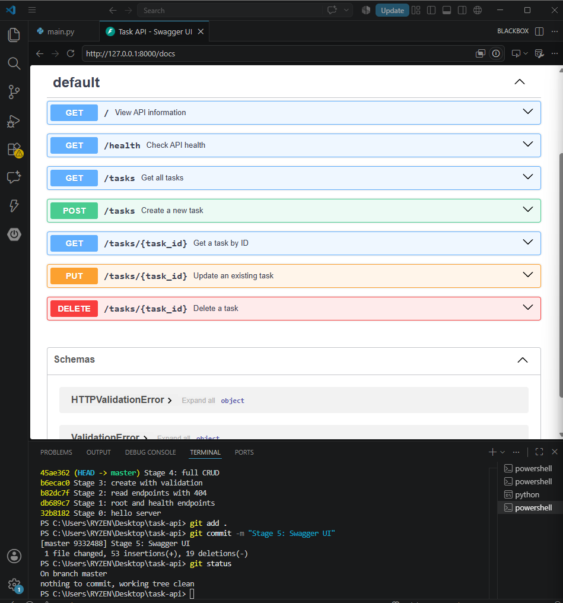

# Task API

A simple CRUD API built with Python and FastAPI for managing a to-do list.

The API supports creating, reading, updating, and deleting tasks. Tasks are stored temporarily in memory, and Swagger UI provides interactive API documentation.

## Features

- Create a task
- View all tasks
- View one task by ID
- Update a task
- Delete a task
- Input validation
- JSON error responses
- Swagger UI documentation
- Health check endpoint

## Technologies

- Python
- FastAPI
- Uvicorn
- Git and GitHub

## Installation

Clone the repository:

```bash
git clone YOUR-GITHUB-REPOSITORY-URL
```

Open the project folder:

```bash
cd task-api
```

Create a virtual environment:

```bash
python -m venv venv
```

Activate it on Windows Command Prompt:

```bash
venv\Scripts\activate.bat
```

Activate it on Windows PowerShell:

```powershell
venv\Scripts\Activate.ps1
```

Install the required packages:

```bash
python -m pip install -r requirements.txt
```

## Run the API

```bash
python -m uvicorn main:app --reload
```

Open the API:

```text
http://127.0.0.1:8000
```

Open Swagger UI:

```text
http://127.0.0.1:8000/docs
```

## Endpoints

| Method | Endpoint | Description | Success Code |
|---|---|---|---|
| GET | `/` | View API information | 200 |
| GET | `/health` | Check API health | 200 |
| GET | `/tasks` | Get all tasks | 200 |
| GET | `/tasks/{task_id}` | Get one task | 200 |
| POST | `/tasks` | Create a task | 201 |
| PUT | `/tasks/{task_id}` | Update a task | 200 |
| DELETE | `/tasks/{task_id}` | Delete a task | 204 |

## Example Task

```json
{
  "id": 1,
  "title": "Learn FastAPI",
  "done": false
}
```

## Example Request

```bash
curl -i -X POST http://127.0.0.1:8000/tasks -H "Content-Type: application/json" -d "{\"title\":\"Buy milk\"}"
```

Example output:

```text
HTTP/1.1 201 Created
content-type: application/json

{"id":4,"title":"Buy milk","done":false}
```

## Status Codes

| Code | Meaning |
|---|---|
| 200 | Request successful |
| 201 | Task created |
| 204 | Task deleted |
| 400 | Invalid request |
| 404 | Task not found |

## Swagger UI



## In-Memory Storage

This project does not use a database. Tasks are stored in a Python list while the server is running.

When the server restarts, newly created tasks and updates disappear, and the original example tasks are restored.

## Author

Created for the FlyRank Backend AI Engineering internship assignment.